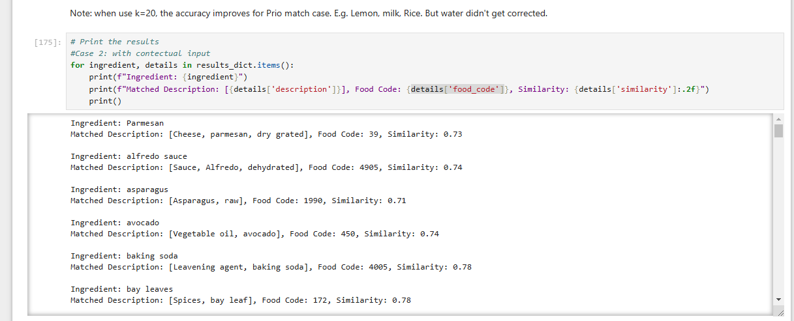

# Data Processing
## Inventory
### Data sources
1. Recipe dataset: https://eightportions.com/datasets/Recipes/#fn:1
2. Ingredient CNF API: https://produits-sante.canada.ca/api/documentation/cnf-documentation-en.html#a6

### Code Folders
1. **DataPrcoessing_1.ipynb**: The main notebook
2. Helpers folder: All helper functions
3. recipes_raw folder: 
    - All raw recipe datasets
    - the **Good_ingredient_List.csv**: the ingredient list we extract from [Food Basic](https://www.foodbasics.ca/aisles/fruits-vegetables?sortOrder=popularity) webiste based on popularity 
    - **recipes_raw_processed.json**: Processed recipe that only contains ingredients in the Good ingredient list
4. datasets folder: 
    - **recipe_dataset_init_{}.json**: Randomly selected small testing dataset from the raw recipe dataset. The number means number of items. 
    - **processed_recipes_init_{number of corresponding recipes before process}_ batch_**: Initially **processed** recipe datasets. Batch size 50, batch files are indexed in asc order. 
    - CNF_API_food_code.json: Ingredient food code dataset from CNF
    - emb folder: the processed embedding and faiss index for descriptions in the CNF_API_food_code.json
    - **testing** folder: 
        - tuning_ingre_list.csv: 80% of the Good ingredient list
        - test_ingre_list.csv: 20% of Good ingredient list
5. **ingre_nutrition_map**: Where the map and the unit map is stored

### Main Code Walkthrough

Please read the main notebook about how to use them. Following are some helper functions if you just want to run the process end to end.

#### To have a smaller dataset for testing
See this example test function `recipe_dataset_gen.test_get_testing_dataset`, and use the functions called inside 

#### To process the paragraph style recipes into structured labels
See main notebook `get_processed_recipe_dataset()`

#### To get nutrient mapping for the processed recipes:

See main notebook **Ingredient-Nutrient Mapping** section. The major functions are:
1. get_food_code_for_ingredients()
2. get_all_ingredient_mapping()
3. food_nutrient_mapping_helpder.save_nut_map

### Methods

Currently we are using `text-embedding-ada-002` model to do similarity search to get nutrient content for a ingredient. 
Please refer to ** Start Similarity search** section in main notebook, and check the following block to get a sense: 

